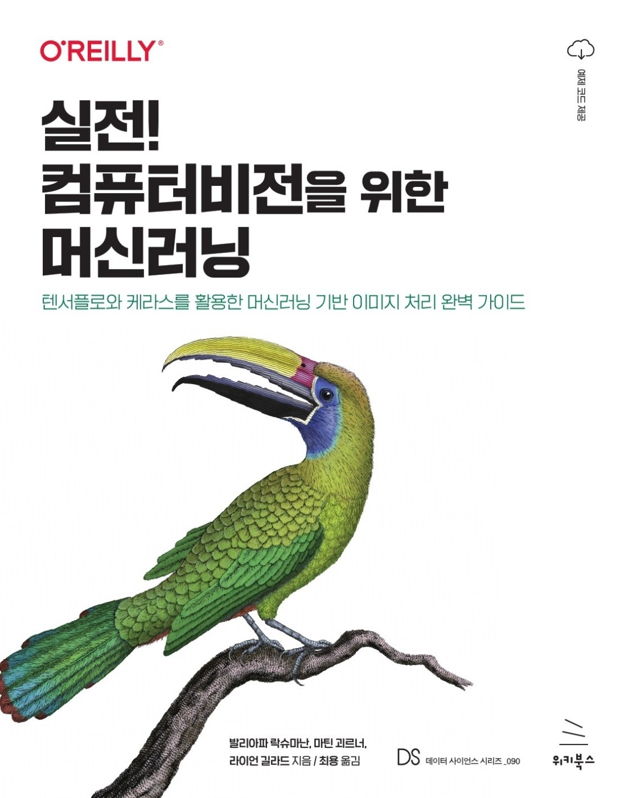

# 실전! 컴퓨터비전을 위한 머신러닝

(원제: Practical Machine Learning for Computer Vision)

발리아파 락슈마난, 마틴 괴르너, 라이언 길라드 지음 / 최용 옮김

홈페이지: <https://wikibook.co.kr/mlvision/>

</a>

** 구글의 공식 제품이 아님**


# 빠르게 둘러보기

이 책에 대해 자세히 알고 싶으면 아래의 ‘천천히 둘러보기’를 보라.

이미지에 대한 머신러닝(ML: machine learning)으로 인해 헬스케어, 제조, 소매 등 여러 분야에 혁신이 일어나고 있다. 이미지에서 객체(object)를 식별하도록 머신러닝 모델을 훈련함으로써, 과거에 풀기 어려웠던 여러 문제를 풀 수 있게 됐다. 이 책은 빠르게 발전하는 머신러닝 분야의 근간을 이루는 ML 아키텍처를 직관적으로 설명하고, 분류(classification), 측정(measurement), 검출(detection), 세분화(segmentation), 표현(representation), 생성(generation), 계수(counting) 등의 문제를 해결하는 실용적인 코드를 제공하고자 한다.

이미지 분류는 딥러닝의 ‘헬로 월드’다. 그러므로 이 책은 딥러닝의 전 과정을 실용적인 관점에서 소개한다. 이 책은 자연어 처리와 같은, 딥러닝의 다른 도메인으로 가는 디딤돌 역할을 할 수 있다. 물론, 자세한 사항은 이 책을 읽어 보기 바란다.

## 실습
이 ‘간단한 소개’에서는 책의 깃허브 저장소에 있는, 이미지 이해를 위한 전 구간(end-to-end) 머신러닝 모델을 Google Cloud Vertex AI를 사용해서 만들어 본다.
실습할 내용은 다음과 같다.
* Vertex AI 노트북(Notebook) 시작하기
* 5-flowers 데이터셋 준비
* 꽃을 분류하는 전이 학습(Transfer Learning) 이피션트넷(EfficientNet) 모델(model)을 훈련(train)
* 모델을 배포(deploy)
* 예측(prediction)을 설명
* 스트리밍 파이프라인에서 모델을 호출.

<b> 실습을 위해 새로운 GCP 프로젝트를 만드는 것이 좋다. 실습을 마친 후에는 프로젝트를 삭제하고, 모든 리소스가 삭제됐는지 확인하라. </b>

## 1. Vertex AI Workbench 인스턴스 셋업

### GPU 할당량 확인

[GCP 콘솔](https://console.cloud.google.com/)을 열고 IAM 및 관리자 → 할당량으로 이동한다. 다음 주소를 바로 열어도 된다. https://console.cloud.google.com/iam-admin/quotas

필터에 Nvidia까지 타자하고 NVIDIA T4 GPUs를 선택한다. 한도가 0보다 큰 리전이 있어야 한다. 그렇지 않은 경우 할당량 증가를 요청하라.

참고: 원한다면 이 실습에 GPU가 아닌 CPU를 사용해도 된다. 훈련은 더 오래 걸린다. 다음 단계에서 non-GPU 옵션을 선택하면 된다.

### GCP 콘솔에서 노트북 만드는 곳으로 가기

[https://console.cloud.google.com/](https://console.cloud.google.com/)에서 GCP 콘솔을 열고 Vertex AI → Workbench로 이동한다. [https://console.cloud.google.com/vertex-ai/workbench](https://console.cloud.google.com/vertex-ai/workbench)를 바로 열어도 된다.

페이지 상단의 +NEW NOTEBOOK을 클릭한다. TensorFlow Enterprise 2.6 with Tesla T4를 선택한다.

### 노트북 인스턴스 만들기

인스턴스 이름은 mlvision-book-gpu로 지정

NVIDIA GPU 드라이버 자동 설치 체크박스를 클릭한다. NVIDIA 드라이버를 설치하려면 박스에 체크해야 한다. 안 했으면 인스턴스를 삭제하고 다시 만들어라.

만들기를 클릭해 그 밖의 기본값을 사용한다.

이 단계를 수행하는 데 10분 정도 걸린다.

### 책의 코드 저장소를 복제하기

JUPYTERLAB 열기 링크를 클릭

JupyterLab에서 Git Clone 버튼(왼쪽 패널의 상단 맨 오른쪽 버튼)을 클릭.  
텍스트박스에 다음을 타자한다. https://github.com/GoogleCloudPlatform/practical-ml-vision-book  
참고: 터미널을 열어서 다음을 타자해도 된다.  
```git clone https://github.com/GoogleCloudPlatform/practical-ml-vision-book```

<b>Vertex AI Notebook으로 여러 노트북을 실행하면 GPU 메모리 부족 오류가 발생할 수 있다. 이를 피하려면, 새 노트북을 열기 전에 Kernel 메뉴의 "Shut Down All Kernels..."를 선택하라.</b>

## 2. 전이 학습 모델 훈련

이 노트북에는 이미지 분류를 하기 위한 핵심 머신러닝이 있다. 이후 단계에서 이것을 end-to-end 워크플로에서 개선할 것이다.

### 노트북 열기

practical-ml-vision-book/03_image_models/03a_transfer_learning.ipynb로 이동한다.

### 셀 지우기

Edit → Clear All Outputs를 선택해 셀을 지운다.

### 셀 실행하기

셀을 하나씩 실행한다. 셀을 읽는다. 그런 다음, Shift + Enter를 눌러 실행한다.


## 3. ML 데이터셋 준비 [Optional]

이 단계에서는 ML의 효율을 높이도록 준비된 데이터로 구성된 훈련, 검증, 테스트 데이터셋을 만든다. 데이터는 TensorFlow Records 형식으로 작성된다.

### 노트북 열기

practical-ml-vision-book/05_create_dataset/05_split_tfrecord.ipynb 로 이동

### 클라우드 스토리지 버킷 만들기

브라우저 창을 따로 열어서 GCP 콘솔의 [Cloud Storage 섹션](https://console.cloud.google.com/storage/browser)에서 버킷을 만든다. 이미 존재하는 이름으로는 버킷을 만들 수 없다.

노트북 인스턴스가 있는 리전에 버킷이 있어야 한다.

### Dataflow 작업 구성

노트북에서 다음 코드가 있는 셀(맨 아래에서 두 번째 셀)을 찾는다.
```python -m jpeg_to_tfrecord```

BUCKET 설정을 이전 단계에서 만든 버킷 이름으로 바꾼다. 예를 들어, 다음과 같이 설정할 수 있다.
```BUCKET=abc-12345```


### Dataflow 작업 실행

Shift + Enter를 클릭해 셀을 실행

### Dataflow 작업 모니터링

GCP 콘솔의 [Dataflow 섹션](https://console.cloud.google.com/dataflow/jobs)에서 Dataflow 작업 진행을 본다.
작업이 완료되면 버킷에 데이터셋 3개가 만들어진 것을 볼수 있을 것이다.

참고: 이 작업을 완료하는 데 20분이 걸린다. 따라서 다음 단계는 버킷 `gs://practical-ml-vision-book/`에 만들어둔 데이터셋으로 시작할 것이다.


## 4. 훈련 및 SavedModel 익스포트

이 단계에서는, TensorFlow Records에 담긴 데이터로 전이 학습 모델을 훈련할 것이다. 그런 다음, SavedModel 포맷에 있는 훈련된 모델을 export/flowers_model이라는 이름의 로컬 디렉터리에 익스포트한다.

### 노트북 열기

practical-ml-vision-book/07_training/07c_export.ipynb로 이동

### 셀 지우기

Edit → Clear All Outputs를 선택해 셀을 지운다.

참고: 이 노트북은 완전한 데이터셋으로 훈련한다. GPU에서는 5분 정도면 끝나지만, CPU로는 훨씬 오래 걸린다. GPU가 아닌 CPU를 사용한다면, 첫 (00, 01) 샤드만 처리하도록 PATTERN_SUFFIX를 바꾸고 3 에포크만 훈련하라. 결과 모델은 별로 정확하지 않겠지만 적절한 시간 내에 다음 단계로 넘어갈 수 있을 것이다. 노트북의 “Training” 섹션의 첫 번째 셀에서 이렇게 변경할 수 있다.

### 셀 실행하기

셀을 하나씩 실행한다. 셀을 읽는다. 그런 다음, Shift + Enter를 눌러 실행한다.


## 5. Vertex AI에 모델을 배포

이 단계에서는 모델을 Vertex AI상의 REST 웹 서비스로 배포하고, 온라인 및 일괄 예측과 스트리밍 예측을 시도할 것이다.

### 노트북 열기

practical-ml-vision-book/09_deploying/09b_rest.ipynb로 이동

### 셀 지우기

Edit → Clear All Outputs를 선택해 셀을 지운다.

### 셀 실행하기

셀을 하나씩 실행한다. 셀을 읽는다. 그런 다음, Shift + Enter를 눌러 실행한다.


## 6. ML 파이프라인 만들기
이 단계에서는 ML 파이프라인으로서 end-to-end ML 워크플로를 배포하여, 반복가능한 실험을 쉽게 실행 할 수 있도록 한다.

Vertex AI Pipeline은 아직 프리뷰이므로, GKE에서 OSS Kubeflow Pipelines를 실행하는 파이프라인을 만들 것이다.

### GKE에서 Kubeflow Pipelines 시작

[https://console.cloud.google.com/ai-platform/pipelines/clusters](https://console.cloud.google.com/ai-platform/pipelines/clusters)를 열고 새 인스턴스를 클릭한다.

### GKE 클러스터 만들기

Marketplace에서 구성을 클릭한다.

새 클러스터 만들기를 클릭한다.

Cloud API에 대한 액세스를 허용 박스에 체크

영역이 올바른지 확인한다.

새 클러스터 만들기를 클릭한다. 이 작업에 약 5분이 걸린다.

클러스터에 Kubeflow를 배포

앱 인스턴스 이름을 mlvision-book으로 변경

Deploy를 클릭한다.  이 작업에 약 5분이 걸린다.

Kubeflow Host ID를 메모

콘솔의 AI Platform 파이프라인 섹션에서(Refresh를 클릭해야 할 것이다), Settings를 클릭하고 Kubeflow Host ID를 적어둔다. `https://40e09ee3a33a422-dot-us-central1.pipelines.googleusercontent.com`과 같이 되어 있을 것이다.


### 노트북 열기

practical-ml-vision-book/10_mlops/10a_mlpipeline.ipynb로 이동

### Kubeflow 설치

첫 번째 셀에서 pip install kfp를 실행한다.

그런 다음, 노트북 상단의 리본에 있는 버튼을 눌러 커널을 재시작한다.

두 번째 셀에서 KFPHOST 변수를 위에서 메모한 AI Platform Pipelines SDK 설정의 호스트명으로 바꾼다.
셀 지우기

Edit → Clear All Outputs를 선택해 셀을 지운다.

### 셀 실행하기

셀을 하나씩 실행한다. 셀을 읽는다. 그런 다음, Shift + Enter를 눌러 실행한다.

generated Run details 링크를 클릭한다.

워크플로가 완료될 때까지 기다린다.


## 축하
축하한다! 이미지 분류를 위한 end-to-end 머신러닝 모델을 성공적으로 구축했다.


# 천천히 둘러보기

간단히 알아보고 싶으면 빠르게 둘러보기(위쪽)를 보라.

<b> 실습을 위해 새로운 GCP 프로젝트를 만드는 것이 좋다. 실습을 마친 후에는 프로젝트를 삭제하고, 모든 리소스가 삭제됐는지 확인하라. </b>

### 1. GPU 할당량 확인

[GCP 콘솔](https://console.cloud.google.com/)을 열고 IAM 및 관리자 → 할당량으로 이동한다. 다음 주소를 바로 열어도 된다. https://console.cloud.google.com/iam-admin/quotas

필터에 Nvidia까지 타자하고 NVIDIA T4 GPUs를 선택한다. 한도가 0보다 큰 리전이 있어야 한다. 그렇지 않은 경우 할당량 증가를 요청하라.

### 2. GCP 콘솔의 Vertex Workbench 만들기 부분으로 이동

[GCP 콘솔](https://console.cloud.google.com/)을 열고 Vertex AI → Vertex Workbench로 이동한다. https://console.cloud.google.com/vertex-ai/workbench/ 로 바로 가도 된다.

페이지 상단의 +NEW NOTEBOOK을 클릭한다. 그 다음에, TensorFlow Enterprise 2.6 with Nvidia Tesla T4를 선택한다.

### 3. 노트북 인스턴스 만들기

인스턴스 이름은 mlvision-book-gpu로 지정

NVIDIA GPU 드라이버 자동 설치 체크박스를 클릭한다. NVIDIA 드라이버를 설치하려면 박스에 체크해야 한다. 안 했으면 인스턴스를 삭제하고 다시 만들어라.

고급 옵션을 클릭

머신 유형을 n1-highmem-4로 변경

GPU 유형을 Nvidia Tesla T4로 변경

디스크 → Data 디스크 크기를 300 GB로

권한 → Single User → 이메일 주소 입력

만들기를 클릭해 그 밖의 기본값을 사용한다.

이 단계를 수행하는 데 10분 정도 걸린다.

### 4. Cloud Storage 버킷 만들기

GCP 콘솔의 [Storage 섹션](https://console.cloud.google.com/storage/browser)으로 이동해서 버킷을 만든다.
이미 존재하는 이름으로는 버킷을 만들 수 없다.
노트북 인스턴스가 있는 리전에 버킷이 있어야 한다.

### 5. 책의 코드 저장소를 복제하기

GCP 콘솔의 Vertex Workbench 섹션으로 간다.
Open JupyterLab 링크를 클릭

JupyterLab에서 git clone 버튼(왼쪽 패널의 상단 맨 오른쪽 버튼)을 클릭.
텍스트박스에 다음을 타자한다. https://github.com/GoogleCloudPlatform/practical-ml-vision-book
주의: 터미널을 열어서 다음을 타자해도 된다.
```git clone https://github.com/GoogleCloudPlatform/practical-ml-vision-book```

### 6. 노트북 실행

* JupyterLab에서 practical-ml-vision-book/02_ml_models 폴더로 이동
* 02a 노트북을 연다.
   * Edit | Clear All Outputs
   * 각 셀을 읽고 Shift + Enter 키를 눌러 하나씩 실행한다. (또는 Run | Restart Kernel and Run All Cells를 클릭)
   * list of running Terminals and Kernels로 간다(JupyterLab의 상단 맨 왼쪽의 두 번째 버튼)
   * 02a 노트북을 중지한다.  <b>노트북 실행 완료 시마다 커널을 중지하라.</b> 그렇게 하지 않으면 메모리가 부족해진다.
* 02b 노트북을 열어 실행하고, 위의 단계를 되풀이한다.
* 3장에서 flowers5 노트북(3a와 3b의 모바일넷)*만* 실행한다.
   * 3a_transfer_learning을 실행
   * 3b_finetune_MOBILENETV2_flowers5를 실행-- AdamW를 찾을 수 없으면 커널을 재시작해야 할 수 있다. 노트북의 지시를 보라.
   * flowers104 노트북 다수는 강력한 머신을 필요로 한다. 우리는 이런 노트북들에 TPU를 썼다. 자세한 사항은 README_TPU.md를 보라. TPU를 사용할 수 없다면 GPU를 추가해봐도 되겠지만, 그렇게는 테스트해보지 않았다.
* 4장에서
   * Unet 세분화는 T4에서만 작동할 것이다.
   * *TensorFlow 2.7 이상에서만 작동* RetinaNet을 실습하려면 해당 디렉터리의 Readme에 있는 지시를 따른다. 12GB 데이터셋을 다운로드/업로드하려면 고대역폭 인터넷 연결이 필요하다. 또한 TensorFlow (2.6이 아니라) 2.7+용으로 새로운 Workbench 인스턴스를 만들어야 한다.

* 5장에서는 노트북을 어느 순서로 실행해도 된다.
* 6장에서:
   * run_dataflow.sh의 BUCKET 변수를 변경
   * 노트북을 순서대로 실행하라.
   * 6h의 TF Transform 노트북은 깨졌음 (파이썬 의존성 문제)

* 7장에서는 노트북을 순서대로 실행하라.
   * 7c에서는, 표시된 BUCKET을 꼭 바꿔야 한다.
* 9장에서는, 노트북을 순서대로 실행한다.
   * ENDPOINT_ID, BUCKET 등을 환경에 맞게 바꿔야 한다.
* 10장에서:
   * [https://console.cloud.google.com/marketplace/product/google-cloud-ai-platform/kubeflow-pipelines](https://console.cloud.google.com/marketplace/product/google-cloud-ai-platform/kubeflow-pipelines)에서 Kubeflow Pipelines Cluster를 시작 
   * 클러스터의 Cloud Platform APIs에 액세스를 허용해야 함
   * 클러스터가 시작되면 "Deploy"를 클릭
   * 배포되면, Kubeflow Pipelines 콘솔로 가는 링크를 클릭하고 Settings을 본다
   * 전달된 HOST 문자열을 노트
   * JupyterLab에서 10a의 KFPHOST 변수를 방금 시작시킨 클러스터를 가리키도록 편집
   * 10a과 10b 실행
* 11장에서는 노트북을 순서대로 실행한다.
* 12장에서는 노트북을 순서대로 실행한다.

### 문제 해결
* <b>Out of memory.</b> 이전에 실행한 노트북을 종료하라.
* <b>AdamW not found.</b> 노트북을 시작할 때 커널을 재시작하라. TensorFlow를 처음 호출하기 전에 AdamW를 임포트해야 한다.
* <b>Bucket permissions problem</b> BUCKET 변수를 당신이 갖고 있는 것으로 바꿔라.
* <b>Weird GPU errors</b> GPU 메모리가 부족한 것이 대부분이다. 다른 노트북을 모두 종료하고 커널을 재시작한 뒤 다시 시도한다.


피드백? 깃허브 저장소에 이슈를 올려달라.
